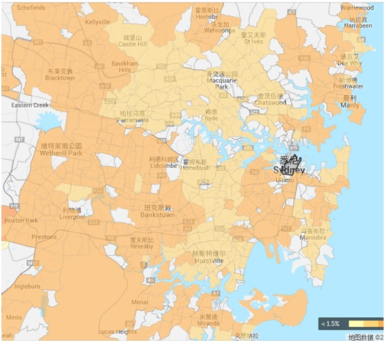

来澳洲之前，本考虑先租两年房子。毕竟到一个新的地方，规矩还没整明白，买房子这种大动作，出错了就很麻烦。而且既然是开始新的生活，总要多了解一下这个国家，以及各个城市，再决定去哪里长期安家。租房子的好处是可以到处搬， 各个区住住，感受一下。
 

澳洲上百万人口的城市有5个，按人口排名为：新洲首府悉尼、维州首府墨尔本、昆州首府布里斯本、西澳首府珀斯、南澳首府阿德莱德。悉尼位于澳洲大陆东岸偏南，这里是气候最好的地方。夏天不会热到无法忍受，冬天也一样绿草如茵。南边的墨尔本偏冷，北边的布里斯本偏热。在悉尼呆了几个月，没事就开车到处溜。开始住在西南区的Liverpool，大家都说西南区治安不好，可能主要因为这里中东移民多一些，我在Liverpool大街上经常看到这些国际友人，倒没觉得与常人有什么不同。自己夜里出去逛过，隔壁屋的小姑娘也经常半夜才回来。所以治安好不好其实是相对而言，慢慢了解多了，知道很多区的居民，出门只关门，不上锁。
 

我自己并没觉得Liverpool有什么不好，唯一的问题是吃不到中餐。开始一个人住，也不开伙，一个多月天天都在外面吃汉堡吃匹萨，实在是吃腻了，于是搬去北区的华人区Eastwood。这一下是个大逆转，Eastwood街上70%以上是亚裔面孔，绝大多数店里都可以说中文。天天有盖浇饭吃了，偶尔还来顿麻辣香锅，下了地铁随时可以从街边买半斤红烧鸡爪回家啃。Eastwood是丘陵地带，经常上下大陡坡，因此树木也多。我租了一栋House的一间房，整个House四周都长了大大小小的树，不见阳光的冬日里，把我冻的够呛。后来明白澳洲的房屋都顺着地势而建，大多数人都喜欢保留原土地上的树木。盖房子的时候，砍树是需要报本地Council审批的。一来并不是所有的树木都能砍，二来砍树的价格也不菲。
 

既然考虑租房子住，当然是想租一个条件好一些的。考虑到我闺女小小年纪眼睛就已经近视，所以想租一个有大草地的House住，让她多在户外活动活动。悉尼3个卧室的House房租中间价大概在$550一周，实际上稍微好一点点的房子，要$650或更多。其实悉尼房租并不算高。以悉尼西部重镇Parramatta为界，以东地区House的价格都在$100万以上，新一点盖的漂亮一些的房子，基本上要奔$150万去了。如果售价在$120万的房子，房租$650一周，那么租售比是2.8%，跟北京地区的房屋租售比差不多。下面是2016年3月的统计结果，每个区的情况用颜色表示，偏黄色的是低于3%的区域，偏橙色则是超过3%的区域，白色区域缺乏足够的统计数字而没有给出结果。可以看出大多数区域的租售比在3%左右。
 
