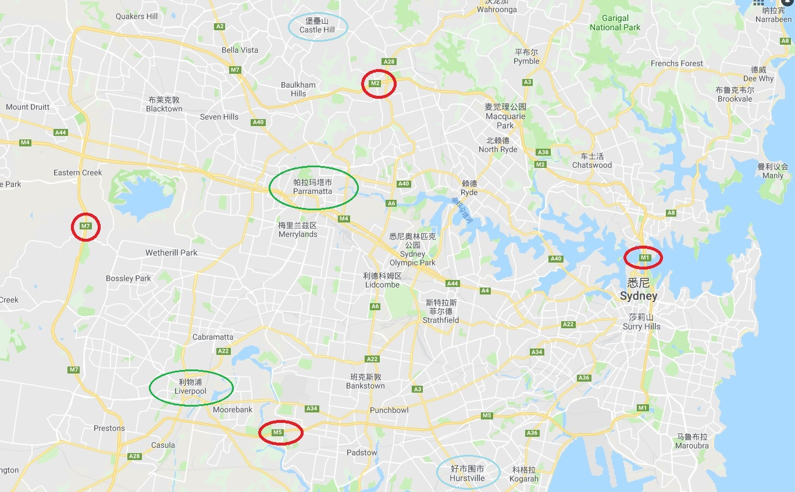
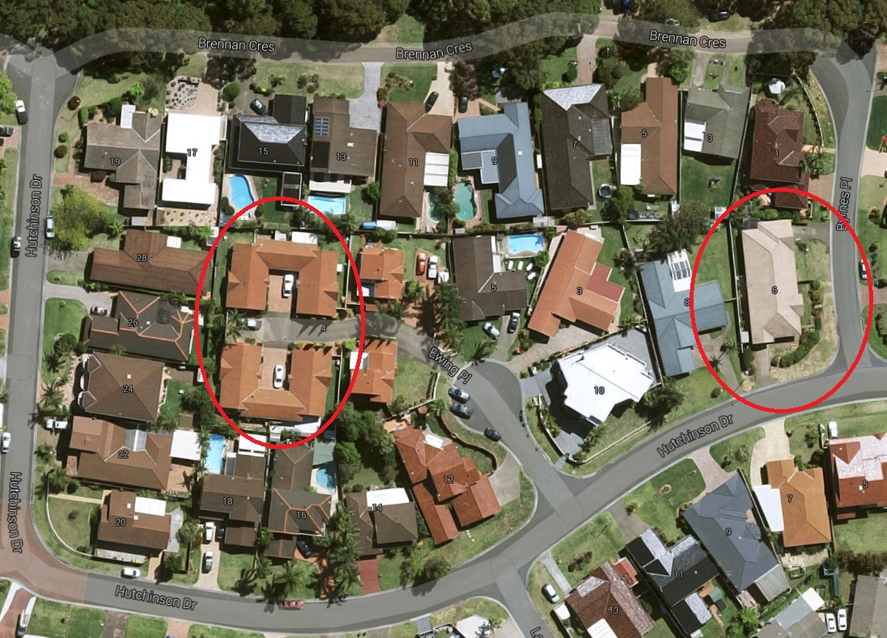
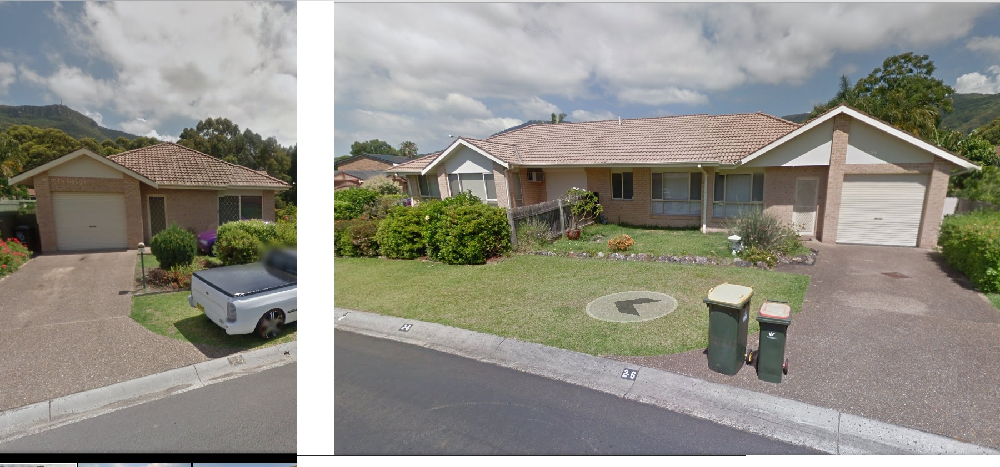

正好这2天看到关于土地税的文章，先补充一下。土地税各州有自己的标准，我前篇文章说的是新南威尔士州，也就是悉尼所在的这个州。包括后面的一些房产开发政策，各州也略有差异。
 

土地税起征标准也在变化，比如2016年的起征点提高到$48.2万。土地税按照自然人计算，夫妻两个人名下的土地各自单独计算。自住房产的土地不做统计（当然买了块空地是不可能申报为自住的）。
 

看房子当然是从看地图开始，下面就是悉尼的地图。我们通常所说的悉尼是由几十（可能上百）个Suburb和city组成，小一点的就是Suburb，大一点的就是city。每个区域都有自己的商业中心及医院等配套建设。叫做Sydney的city只是海边很小的一块地区，这个地区已经成为主要的商业中心。一般大家称之为city或者CBD。每个Suburb都有自己的邮政编码，地址一般都是这样的标准格式：门牌号、街道、Suburb、所属州、邮政编码。所以一个悉尼地区的地址，你可能完全看不到悉尼的字样。
 

悉尼城区内的4条高速可以作为一个简单的地界标志，北面M2，东面M1，南面M5，西面M7。加上东西向的交通枢纽M4，这5条高速都是收费高速（澳洲收费高速很少，主要集中在悉尼墨尔本城区内，城际高速都不收费）。前4条高速框起了悉尼的主要部分。随着悉尼人口的不断增长，城市主要向西北、西、西南方向扩张，西北是重点。比如这个图中最北偏西的Castle Hill，它的西北目前正是一片热土，大量房屋在建设中。悉尼基本上是扁平化发展，4条高速之外并不是郊区，比如M1东面有大量传统富人区，是悉尼最早的一些社区。华人重镇Hurstville也在图中最南偏东。
 
 
很多年前悉尼市政府就规划了三个城市副中心。西北部的Parramata，西南部的Liverpool（图中2个绿圈）和西北很远70公里外的Penrith。事实上只有Parramata真正发展为热闹的中心城区。因而M2北面的Castle Hill、Kellyville、Rouse Hill等区域大量土地被开发，很多新House的广告都是推广这个区域的房子。
 

悉尼东部沿海是传统的富人区，几千万的豪宅大多集中在海边。CBD附近的内西区房价也很贵，这里一则靠近CBD，二则悉尼大学、悉尼理工、新州大学几个大学在这附近，留学生催生出大量需求，买房出租的回报率很好。再向西一些的南北条带，包括从南面的Hurstville一路向北到Ashfield、Burwood，继续向北的Eastwood、Epping地区是主要的华人聚集区（包括Chatswood）。华人大多喜欢住在华人多的地方，吃饭买东西都方便，而且这一带也有很多好的公立小学中学，因此这一线的房价也涨的很快。目前Eastwood的标准House成交价都是$200万左右。再往西，从Sydney Olympic Park到Parramata这一区域属于市场平均价位区域，这个区域标准House的价格是$100万~$200万刀之间(Bankstown是唯一的例外，公认的治安不好区域，70多万)。从Parramata往西，价格越来越低，不过最便宜也在$70万刀以上。
 

据2006年的统计，悉尼有60.9%的房屋是独立屋，也就是House，有自己的前院后院，有临街的车道。从传统占地四分之一英亩（1011平米）到600平米的占地，到最新开发的独立屋，只有400平米占地。悉尼独立屋的占地也是越来越小。除了House，就是半独立屋（2栋房子连着盖在一块土地上），Townhouse和公寓。把地址输入Google地图，结合Google街景，就能很清楚的看到这是一个什么样的房子。比如下图左边这个红圈中是4个Townhouse盖在一起，北面2栋南边2栋，都只有小小的后院。右边这个红圈明显是两个连着的半独立屋结构，南边和东边各有一个车道连着车库，住的是2户人家，所以东边有道矮墙把门前草地分割开来。不过这个房子应该是多年以前按照一栋房子做开发申请的，所以门牌号码是一个，现在已经不允许2栋Townhouse按照一栋房子做申请了。图上其它的房子都是独立屋。
 

 
 
悉尼整个占地不比北京小，东西40公里南北35公里的区域比北京5环还要大。而这里只居住了不到500万人。说明澳洲人习惯住House的，如果住房习惯从住House改为住公寓，那悉尼完全不缺地，地就不值钱了。所以要说房产投资，买什么样的房子，这是一个问题。
 

这些年因为澳洲的房产增值很快，并且澳洲政府鼓励海外投资，因此中国几大房地产开发商都在澳洲盖房子。目前完全是简单粗暴的方式。在中东部高价区域，买下一大块连片的土地（可能是几个连着的House），然后推倒了盖公寓。盖出来的公寓完全不愁卖，几百套房子半天就被抢光。你看销售大厅的照片，清一色的华裔面孔。$200万买套3或4个卧室的House，与$100万买套3个卧室的大公寓，在升值潜力高的同一区域，口袋里资金有限的投资者，明显更喜欢后者。大澳村民已经有人领悟到这种简单粗暴开发模式的奥秘，最近经常看到有新闻说十几户邻居联合卖房，就是卖给建公寓的开发商，最多的一次好像是有近一百户邻居联合卖房，原本只能卖$100多万的House，联合卖房能多卖50%以上的价格。
 

问题是公寓的热卖到底能走多远？每个Suburb可以盖公寓的数量，实际上受到当地council的控制。而council是根据本地公共设施的数量和可容纳居民的数量来判断房屋的建设规模。从这个角度讲公寓数量并不会无限制的膨胀，因此公寓的升值是可预期的。但事实并不一定如此，比如悉尼某些地段早晚高峰时间车速只有十几公里，这些地段明显靠近公寓较多的Suburb，看上去公共设施已经不足以满足人口的增长。从另一个角度看，房子越来越贵，澳洲人是选择住离CBD更远的House，还是选择改住公寓？这决定了公寓的价格到底能走多远。
 

在我看来，公寓的升值是House升值的附带效果。公寓的购买者多数是投资客，或者是未来的投资客。公寓的大量投放，能有效缓解当地的租房需求，同样抑制当地的房价上涨速度。那么当房地产增值放缓，首先受到波及的应该就是公寓。另一方面，投资公寓，收益只来源于房产增值和出租收益，灵活性不高，想象空间不大。比如开发商买地盖公寓的例子，住House的人可能因为土地升值而获得额外的收益。简单的说就是你们家这地区房子本来就升值了，现在又有开发商来征地，而且他还不可能强拆你，你说能不赚么？当然，土地的变化其实很多，下回再说。

